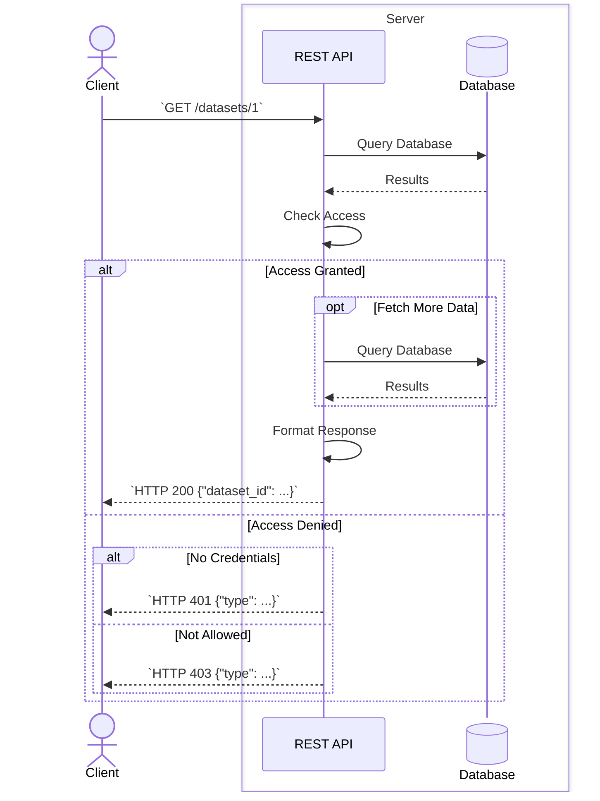

# Project overview

This page describes the context in which the REST API is deployed,
as well as a rough structure of the codebase.

## Context of the REST API

!!! info "For Core Contributors"

    If you are an OpenML core contributor, more information on the services and how they are deployed is available in an internal wiki.
    Please reach out to in the `#core` Slack channel for access.

The REST API should always be deployed with access to a database.
In production, these services are deployed in a kubernetes cluster.
A typical request flow would then follow this pattern:

Note that authentication or authorization is required primarily for operations which mutate the database in some way (uploading, tagging, ...).
Besides the REST API and the database, the server will also have a number of auxiliary services deployed which support background processes on incoming data:

 - An Evaluation Engine analyzes uploaded datasets to compute its "features" and "qualities" , processes uploaded runs to create "evaluations" and creates task splits. Some of these actions update database state (through calling REST API endpoints).
 - A MinIO server server for file storage. The REST API will stores uploaded datasets and runs there (not yet implemented).
 - An Elastic Search server (see ["Elasticsearch"](#elasticsearch) below).
 - A service which creates a [Croissant](https://github.com/mlcommons/croissant) metadata file for a new dataset.
 - A service which converts uploaded ARFF datasets to Parquet (to be phased out as ARFF is phased out).

### Elasticsearch
We have Elasticsearch (ES) indices which reflect the state of the database and make it easily accessible to e.g., the website.
The PHP-based REST API directly inserts documents into the ES indices.
This is problematic because:

  - The REST API will return errors if the Elasticsearch service is unavailable, depending on the endpoint, this results in:
     - the request being stopped early with an error, even if otherwise it would successfully complete the request.
     - the request completes the request, but then returns an error anyway because of the failure to update the ES index. The user is unaware that his request actually succeeded.
  - The REST API has no job queue for inserting these documents, which means if it fails once it is not inserted again, potentially leading to an out-of-sync index.
  - If the ES service is available, the internal roundtrip to update the index adds to server response times.

For these reasons, this REST API implementation will not directly connect to Elasticsearch for creating or updating indices.
Instead, we will use e.g., a Logstash pipeline to construct and update the indices directly from the database or make use of a Message Bus.
Because a Message Bus keeps some of the disadvantages listed above, we're more likely to use the Logstash approach.
The database schema does not accommodate this well, however.
For example, there is generally no way to tell which data is removed or updated.
In practice, this means that initially the Logstash pipeline will just recreate the indices periodically.

In [Phase 3](../roadmap.md#phase-3-revisiting-the-database) we can update the schema to work better with Logstash.

The REST API _may_ make use of ES in the future for e.g., list operations.
These operations which list lots of data aggregated from many different tables would be considerably faster if we query them from a preconstructed index instead.

For more info, see [issue#233](https://github.com/openml/server-api/issues/233).

### Authentication
Authentication is currently supported by providing an api key as a query parameter (mimicking the PHP REST API).
To avoid accidentally leaking credentials (e.g., with an HTTP request, or our server access logs), we will move this form of authentication to the HTTP header, see [issue#203](https://github.com/openml/server-api/issues/203).
Ultimately, it would be good to use a dedicated service for authentication, preferably with OAuth, see [issue#69](https://github.com/openml/server-api/issues/69)(externalizing authentication).

## Repository Directory Structure
The diagrams below can be used as a rough indication for the repository file structure.
Many subdirectories and files are omitted to highlight the structure rather than specific content.
Omissions are *not* explicitly mentioned in the diagram.
The structure of the `src/` directory is documented in ["Writing Code"](code.md) and that of the `tests/` directory in ["Writing Tests"](tests.md).

